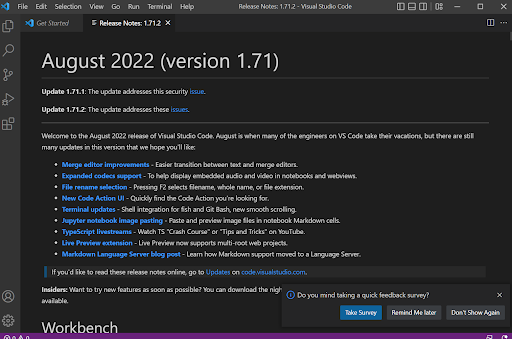
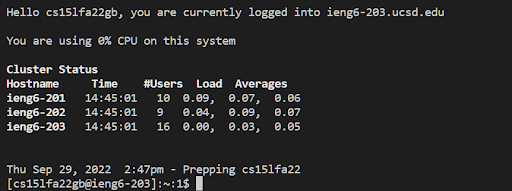
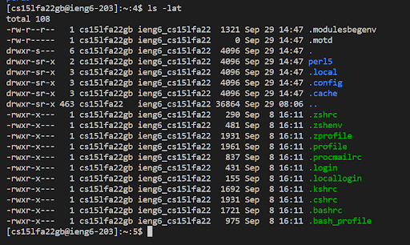
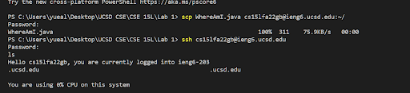
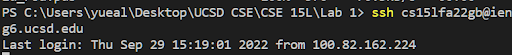
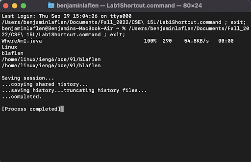

# Remote SSH for UCSD Students tutorial

Welcome! In this tutorial, I will be telling how to set up remote ssh for any of your courses for UCSD.

## Step 1: Install VSCode
First, off you'll need to download (Visual Studio Code)VSCode. VSCode is a pretty good code editor made by Microsoft.



When you first open it up you should be greeted by something like this.

## Step 2: Remotely Connecting
Next, we will ssh into our remote machine. To start, open the integrated terminal in VSCode by clicking terminal at the top menu, then click new terminal. Then in your terminal enter in this command (replace cs15lfa22zz with the account that you want to ssh into).

```
ssh cs15lfa22zz@ieng6.ucsd.edu
```
Say yes to any prompts that you are given until you are asked for the password. If you haven't set up your password or forgotten yours [click here](https://sdacs.ucsd.edu/cgi-bin/alloc-query) to reset it for your class.

After you enter your password you should see something like this:



## Step 3: Try running some commands
To test out your machine you can try running some linux commands.
```
cd ~
ls
ls -lat
```
Here is what it looks like to run ls -lat

It lists out all of the files, including the hidden ones, along with some other detailed information like read, write, and execution specifiers.


## Step 4: Copy over files using scp
You can also copy over files from your local machine to the remote machine using the command scp. To get started first exit the remote machine by typing the command 'exit' or use CTRL+D.

Then, on your local machine use this command to copy over whatever files you'd like. Remember to replace 'cs15lfa22zz' with your account name.

```
scp WhereAmI.java cs15lfa22zz@ieng6.ucsd.edu:~/
```
This is what it looks like:



You can also import multiple files with one command, just list one file after another.

## Step 5: Setup ssh keys
Next you want to set up SSH keys so that you don't have to keep entering in a password to ssh. Follow this code:

```
# on client (your computer)
$ ssh-keygen
Generating public/private rsa key pair.
Enter file in which to save the key (/Users/joe/.ssh/id_rsa): /Users/joe/.ssh/id_rsa
Enter passphrase (empty for no passphrase): 
Enter same passphrase again: 
Your identification has been saved in /Users/joe/.ssh/id_rsa.
Your public key has been saved in /Users/joe/.ssh/id_rsa.pub.
The key fingerprint is:
SHA256:jZaZH6fI8E2I1D35hnvGeBePQ4ELOf2Ge+G0XknoXp0 joe@Joes-Mac-mini.local
The key's randomart image is:
+---[RSA 3072]----+
|                 |
|       . . + .   |
|      . . B o .  |
|     . . B * +.. |
|      o S = *.B. |
|       = = O.*.*+|
|        + * *.BE+|
|           +.+.o |
|             ..  |
+----[SHA256]-----+
```

If you're using Windows do this step as well in a powershell ran as an administrator:

```
# By default the ssh-agent service is disabled. Configure it to start automatically.
# Make sure you're running as an Administrator.
Get-Service ssh-agent | Set-Service -StartupType Automatic

# Start the service
Start-Service ssh-agent

# This should return a status of Running
Get-Service ssh-agent

# Now load your key files into ssh-agent
ssh-add $env:USERPROFILE\.ssh\id_rsa
```

Then run these commands on the server and local machine respectively to copy over the public key
```
# now on server
$ mkdir .ssh
$ <logout>

# back on client
$ scp /Users/joe/.ssh/id_rsa.pub cs15lfa22@ieng6.ucsd.edu:~/.ssh/authorized_keys
# You use your username and the path you saw in the command above
```

After that you should be able to ssh and scp without having to type a password.




## Step 6: Optimizing Remote Running
After all that you can optimize even more. For example, you can run commands on the remote server using ssh.
```
ssh cs15lfa22@ieng6.ucsd.edu "ls"
```

Or run multiple commands in one line

```
cp WhereAmI.java OtherMain.java; javac OtherMain.java; java WhereAmI
```
or use the up arrow to use previous commands.

Here is an example of running multiple commands on one line: 



That's it! you should be all setup by now.