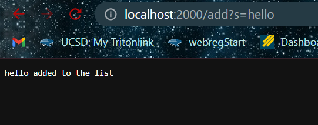
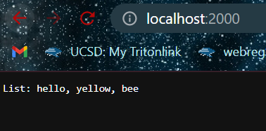
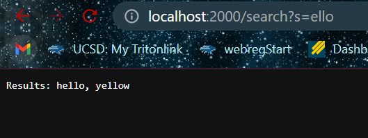
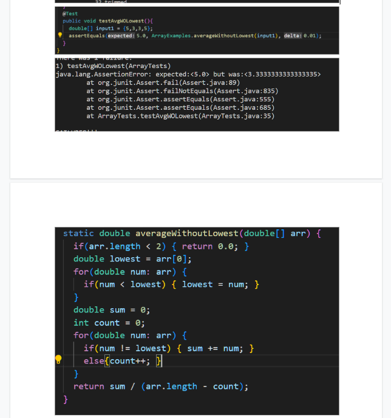
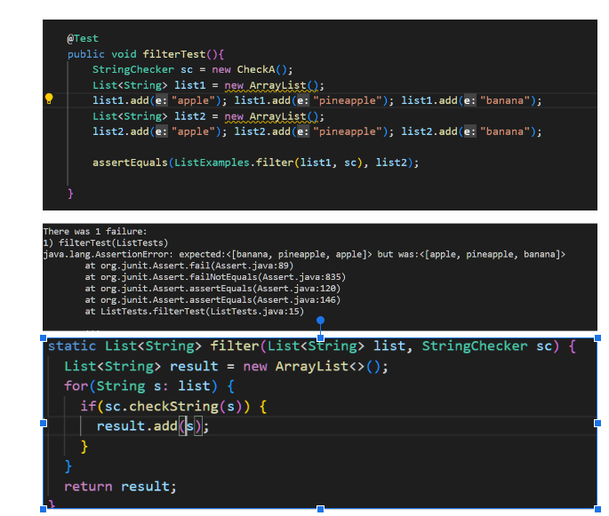

# Week 3 Lab Report
## Part 1

```
public String handleRequest(URI url) {
        if (url.getPath().equals("/")) {
            return String.format("List: " + String.join(", " , stringList));
        } 
        else if(url.getPath().contains("/search")){
            String[] parameters = url.getQuery().split("=");
            if (parameters[0].equals("s")) {
                ArrayList<String> searchList = new ArrayList<>();
                for(String str : stringList) if(str.contains(parameters[1]) ) searchList.add(str);
                return String.format("Results: " + String.join(", ", searchList));
            }
        }
        else {
            System.out.println("Path: " + url.getPath());
            if (url.getPath().contains("/add")) {
                String[] parameters = url.getQuery().split("=");
                if (parameters[0].equals("s")) {
                    stringList.add(parameters[1]);
                    return String.format("%s added to the list ", parameters[1]);
                }
            }
        }
        return "404 Not Found!";
    }
}
```







For all of the screenshots, they will call on the handleRequest method to parse out the commands to the server. For the add request, the argument passed into the server is a string after 'add?s=' which is 'hello' in this case. The string is then added to stringList which is kept by the server. For the second screenshot, an empty path, takes no arguments and displays the contents of stringList. For the third screenshot, handleRequest, reads 'search' and then takes in a string s as an argument. Then the server displays all of elements of stringList that contains s.

## Part 2



The symptom for averageWithoutLowest was that it was giving the wrong output for an array that had more than one lowest numbers. The bug was that the method doesn't keep track of the number of lowest numbers that its not counting for its average and it wasn't taking that into account in the return statement. It would only remove one from the divisor instead of the number of lowest numbers.



The symptom for the filter method for List was that it gave back the filtered list in a reversed order instead of in the order of the original list. The bug was that the method added elements to the front of the list instead of the end. As a result, it would place the most recently check items in the front of the list resulting in a reverse order.